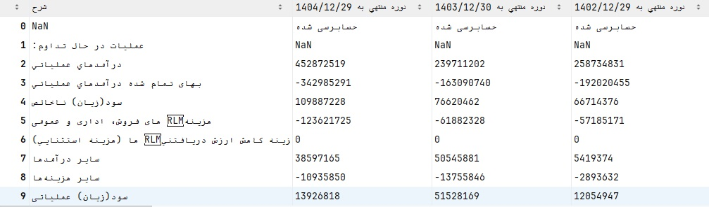
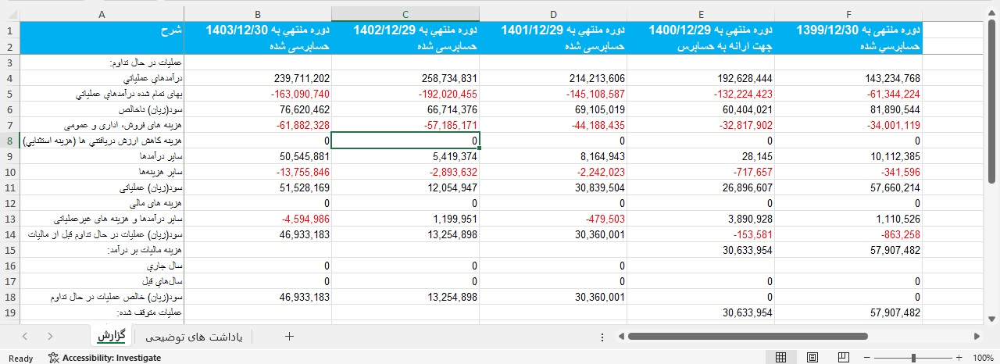
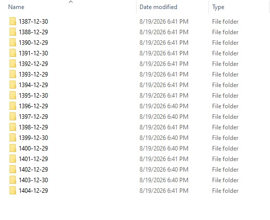
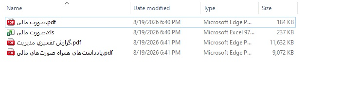

# CodalFinancialData

کتابخانه‌ای پایتونی برای **دریافت، استخراج و پردازش صورت‌های مالی از سامانه کدال**.

این پروژه امکان دریافت اطلاعات صورت‌های مالی شرکت‌ها از کدال و تبدیل آن‌ها به داده‌های قابل استفاده در Python را فراهم می‌کند. علاوه بر داده‌های خام، امکان تبدیل اطلاعات به `Pandas DataFrame` و خروجی گرفتن به صورت `Excel` نیز وجود دارد.

همچنین در صورت نیاز، می‌توان فایل های  گزارش‌های پیوست و صورت های مالی را به صورت خودکار دانلود کرد.

---

## امکانات

* دریافت و فیلتر صورت‌های مالی بر اساس نماد، نوع گزارش و بازه زمانی
* پشتیبانی از گزارش‌های اصلی، تلفیقی و حسابرسی‌شده
* دریافت داده‌های خام و تبدیل آن‌ها به `Pandas DataFrame`
* خروجی گرفتن صورت‌های مالی در قالب `Excel`
* دانلود خودکار گزارش‌های پیوست و صورت‌های مالی
* دانلود همزمان فایل‌ها با `ThreadPoolExecutor`
* مدیریت پایدار درخواست‌ها با `requests.Session` و Retry
* جلوگیری از دانلود فایل‌های تکراری
* دسته‌بندی و ذخیره فایل‌ها بر اساس تاریخ گزارش

---

## نصب

ابتدا Repository را Clone کنید:

```bash
git clone https://github.com/mehdiesmaeilzadeh/CodalFinancialData.git
cd CodalFinancialData
```

سپس وابستگی‌های پروژه را نصب کنید:

```bash
pip install -r requirements.txt
```

---

## دریافت صورت‌های مالی

تابع `get_financial_report` وظیفه دریافت و فیلتر کردن گزارش‌های مالی از کدال را بر عهده دارد.
خروجی مستقیم تابع get_financial_report شامل داده‌های استخراج‌شده از گزارش‌های کدال است.
در این مرحله، داده‌ها هنوز به DataFrame تبدیل نشده‌اند و می‌توان از ساختار خام آن‌ها برای پردازش‌های اختصاصی استفاده کرد.


نمونه کامل:

```python
from Codal import *

all_datasource = get_financial_report(
    symbol="زاگرس",
    statement_name="صورت سود و زیان",
    length=12,
    from_date="1400/01/01",
    to_date="1405/01/01",
    mains=True,
    consolidatable=True,
    NotConsolidatable=True,
    NotAudited=False,
    Audited=True,
)
```

## پارامترهای تابع

| پارامتر             | توضیح                         |
| ------------------- | ----------------------------- |
| `symbol`            | نماد شرکت در کدال             |
| `statement_name`    | نام صورت مالی موردنظر         |
| `length`            | طول دوره گزارش‌های موردنیاز   |
| `from_date`         | تاریخ شروع                    |
| `to_date`           | تاریخ پایان                   |
| `mains`             | دریافت گزارش‌های اصلی         |
| `consolidatable`    | دریافت گزارش‌های تلفیقی       |
| `NotConsolidatable` | دریافت گزارش‌های غیرتلفیقی    |
| `Audited`           | دریافت گزارش‌های حسابرسی‌ شده |
| `NotAudited`        | دریافت گزارش‌های حسابرسی‌نشده |

---


## تبدیل به DataFrame

برای تبدیل داده‌های خام کدال به `Pandas DataFrame` می‌توان از تابع `report_to_dataframe` استفاده کرد:

```python
df = report_to_dataframe(all_datasource)
```



---

## خروجی Excel

برای ذخیره صورت‌های مالی به صورت Excel می‌توان از تابع `report_to_excel` استفاده کرد:

```python
excel = report_to_excel(
    all_datasource,
    path="E:/Report.xlsx"
)
```




---

# دانلود گزارش‌ها و فایل‌های پیوست

در صورتی که گزارش‌های کدال دارای فایل‌های پیوست باشند، می‌توان فایل‌های موجود را به صورت خودکار دانلود کرد.

برای این کار از تابع `download_report` استفاده می‌شود:

```python
download_report(
    all_datasource,
    "E:/codal_files"
)
```




---


---

بنابراین جریان کلی پروژه به شکل زیر است:

```
                    Codal
                      │
                      ▼
          get_financial_report()
                      │
                      ▼
              Raw Financial Data
                 /    |     \
                /     |      \
               ▼      ▼       ▼
          DataFrame  Excel   Download
              │        │        │
              ▼        ▼        ├── PDF
           Pandas   Report.xlsx ├── Excel
                                └── Attachment
```
```


اگر این پروژه برای شما مفید بود، می‌توانید با ⭐ دادن به آن از توسعه آن حمایت کنید.
